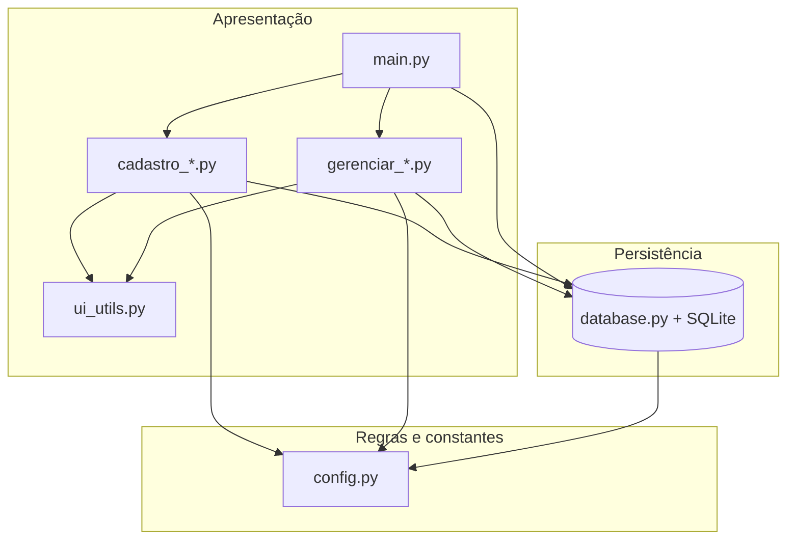
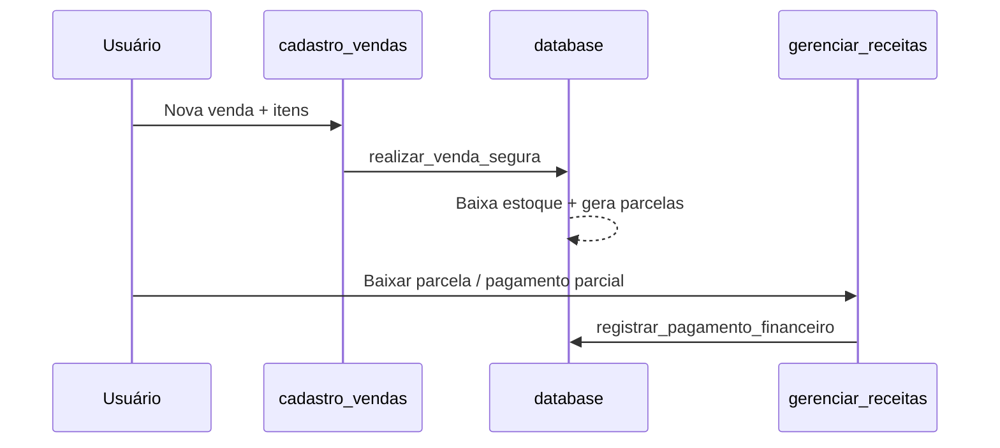

# Alê Sapatilhas — ERP / PDV

Sistema desktop de gestão para loja de calçados e confecções, desenvolvido em **Python** com **Tkinter** e **SQLite**. Projeto voltado a operação comercial real: vendas (PDV), estoque, contatos unificados, contas a pagar/receber e fluxo de caixa.

---

## Funcionalidades

| Área | O que o sistema faz |
|------|---------------------|
| **PDV** | Carrinho, cliente, formas de pagamento, edição de itens e estorno de venda |
| **Estoque** | Cadastro de produtos (SKU, grade cor/tamanho), fornecedor vinculado |
| **CRM** | Cadastro único de **Clientes** e **Fornecedores** |
| **Financeiro** | Receitas (parcelas, pagamento parcial) e despesas (parcelamento) |
| **Relatórios** | Contas a receber/pagar, fluxo de caixa, dashboard com KPIs |

---

## Requisitos

- **Python 3.10+** (recomendado 3.11 ou 3.13)
- **Tkinter** (incluso no instalador oficial do Python no Windows)
- Nenhuma dependência externa obrigatória no `pip` (ver `requirements.txt`)

---

## Instalação e execução

```powershell
# Clone ou abra o repositório
cd c:\VisualCode\Projeto_ERP_PDV\AleSapatilhasVs4.4

# (Opcional) Dados de demonstração
python populardb.py

# Iniciar o sistema
python main.py
```

O banco de dados `AleSapatilhasVs4.4db` é criado automaticamente na pasta `AleSapatilhasVs4.4` na primeira execução.

---

## Arquitetura em camadas

Separação inspirada em ERPs comerciais (Tiny, Bling, Linx): interface, regras de negócio e persistência em módulos distintos.



### Regra de ouro

| Módulo | Responsabilidade |
|--------|------------------|
| `cadastro_vendas.py` | Operação comercial: itens, estoque, estorno |
| `gerenciar_receitas.py` | Baixa de parcelas, pagamento parcial, juros |
| `gerenciar_despesas.py` | Contas a pagar ligadas a fornecedor |
| `database.py` | Transações atômicas (venda + estoque + financeiro) |

O PDV **não** quita parcelas; o financeiro **não** altera quantidade em estoque diretamente.

---

## Estrutura do projeto

```
Projeto_ERP_PDV/
├── README.md                 ← este arquivo
└── AleSapatilhasVs4.4/
    ├── main.py               # Shell principal (menu + listagens)
    ├── config.py             # Constantes de domínio
    ├── database.py           # Schema, migrações e regras de negócio
    ├── ui_utils.py           # Paleta, estilos e mapeamento de status
    ├── cadastro_clientes.py  # Contatos (Cliente / Fornecedor)
    ├── cadastro_produtos.py  # Estoque e ficha técnica
    ├── cadastro_vendas.py    # PDV / checkout
    ├── gerenciar_receitas.py # Contas a receber
    ├── gerenciar_despesas.py # Contas a pagar
    ├── populardb.py          # Seed para testes
    ├── requirements.txt
    └── AleSapatilhasVs4.4db  # Banco SQLite (gerado em runtime)
```

A pasta `EscopoCodigos/` contém rascunhos e notas de desenvolvimento; não faz parte do runtime da aplicação.

---

## Fluxo operacional sugerido



1. Cadastre **fornecedores** e **clientes** em *Adicionar contatos*.
2. Cadastre **produtos** com fornecedor da lista.
3. **Adicionar vendas** (PDV) → confirma venda.
4. **Gerenciar receitas** ou *Contas a receber* → receber parcelas.
5. **Adicionar despesas** → lançar e pagar fornecedores.
6. **Fluxo de caixa** → visão consolidada; duplo clique abre o módulo correto.

---

## Modelo de dados (resumo)

- **clientes** — cadastro unificado (`tipo`: Cliente | Fornecedor)
- **produtos** — estoque; `fornecedor_id` referencia `clientes`
- **vendas** + **itens_venda** — cabeçalho e itens da venda
- **financeiro** — receitas e despesas (parcelas, `valor_pago` para baixa parcial)
- **pagamentos** — log de auditoria (estrutura preparada)

Chaves estrangeiras ativas (`PRAGMA foreign_keys = ON`). Migrações incrementais em `database._migrar_schema()`.

---

## Padrões de código adotados

- **Imports tardios** nos métodos `abrir_*` de `main.py` para evitar import circular entre telas Tkinter.
- **Retorno `(bool, str)`** em operações críticas do banco para a UI exibir mensagens sem acoplar `messagebox` em `database.py`.
- **Constantes** em `config.py` em vez de strings espalhadas (status, tipos, formas de pagamento).
- **Docstrings** nos módulos e funções principais para estudo e manutenção.
- **Transações** com `rollback` em vendas (`realizar_venda_segura`, `cancelar_venda`).

---

## Roteiro de estudo (para o código-fonte)

1. `config.py` — visão geral e constantes  
2. `database.py` — `criar_tabelas`, `realizar_venda_segura`, `registrar_pagamento_financeiro`  
3. `main.py` — `modo_atual`, menu e roteamento de edição  
4. `cadastro_vendas.py` — PDV  
5. `gerenciar_receitas.py` / `gerenciar_despesas.py` — financeiro  
6. `ui_utils.py` — design system leve  

---

## Evoluções possíveis

- Testes automatizados (`pytest`)
- Emissão de relatórios PDF / Excel
- Backup agendado do SQLite
- Autenticação por usuário e perfil de acesso
- API REST para e-commerce (camada separada reutilizando `database.py`)

---

## Licença e autor

Projeto educacional / portfólio — **Alê Sapatilhas Vs 4.4**.  
Ajuste a licença conforme sua necessidade (MIT, uso privado, etc.) antes de publicar o repositório.

---

## Contato

Documentação gerada para apoiar revisão técnica e demonstração de boas práticas de desenvolvimento Python desktop.
